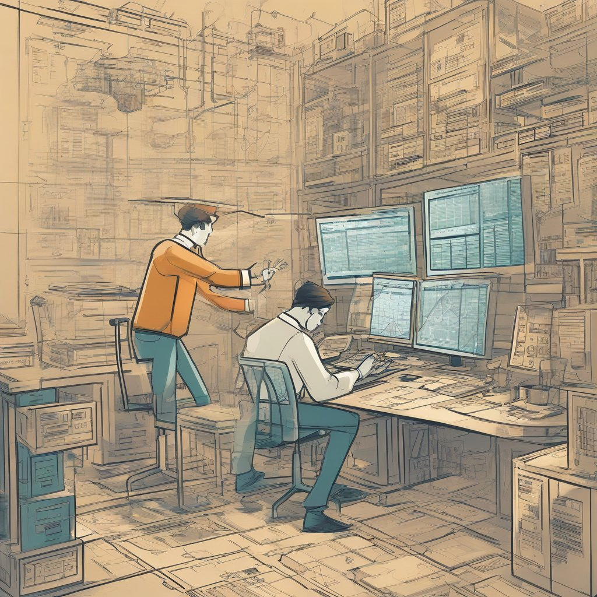

# Course overview {#overview}

{width=75%}

Yihaa you are commited to learning relevant coding using R. The world is now ready to become your oister.

## What can you expect

In this course you will learn how to code in R and it will be fun. You will learn efficient code and workflows that can be used in your own research and for various kinds of data, including all types of omics data. This is really powerful and will lead you to become a better scientist.

## General learning outcomes

-how to code in R.

-how to THINK about data.

-how to think about data separately from your research questions.

-how and why to tidy data and analyze tidy data.

-how to increase efficiency in your research.

## Our workflow plus the Tidy data workflow

We will turning our data tidy and how to use a tidyverse suite of tools to work with tidy data.\
It has been developed by [Hadley Wickham](https://hadley.nz/) and his team, please visit his website if you are interested in learning more.

We will be focusing on a combination of tools:

<u>Basic tools:</u> -**str/glimpse**: Look at data

<u>Tidytools:</u>

\-**Tidy**: `tidyr` to organize rows of data into unique values.

\-**Transform**: `dplyr` to manipulate/wrangle data based on subsetting by rows or columns, sorting and joining.

\-**Visualize**: `ggplot2` static plots, using grammar of graphics principles

This is essential - Instead of building your analyses around the format your data are in, take deliberate steps to make your data tidy. When your data are tidy, you can use a growing suite of powerful analytical and visualization tools instead of inventing home-grown ways to accommodate your data. This will save you time since you aren't reinventing the wheel, and will make your work more clear and understandable to your collaborators (most importantly, Future You).

## Working with data that is not your own

One of the most important things you will learn is how to think about data separately from your own research context. Said in another way, you'll learn to distinguish your data questions from your research questions. Here, we are focusing on data questions, and we will use data that is not specific to your research.

We will be using several different data sets throughout this training, and will help you see the patterns and parallels to your own data, which will ultimately help you in your research.

## Goals of this course

The goal of this course today is to equip you with the tools to take a (your) dataset and do the following:

1.  Import data to R and understand the structure of your data
2.  Look at it using summaries and descriptive statistics
3.  Engineer features relevant for your research
4.  Impute missing data
5.  To do transformation and understand what that means
6.  Plot the data using visually appealing and publish-ready figures

## Prerequisites

A few things need to be checked before we start. First, we assume that you have either [R](https://cloud.r-project.org/) or [RStudio](https://www.rstudio.com/products/rstudio/download/) installed.

Also, if not already installed, please install the following packages: c("dplyr","tidyverse","broom","")

## Credit

This material builds from (and is directly copied from) a lot of fantastic materials developed by others in the open data science community. In particular, it pulls from the following resources, which are highly recommended for further learning and as resources later on. Specific lessons will also cite more resources.

[OHI data science training](https://ohi-science.org/data-science-training/overview.html)

[Modern dive](https://moderndive.netlify.app/1-getting-started)
