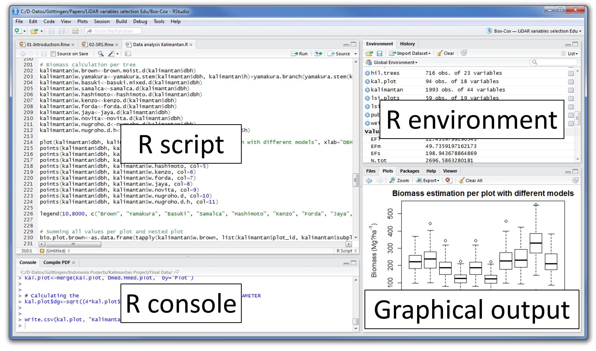
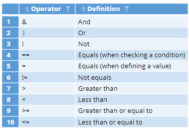
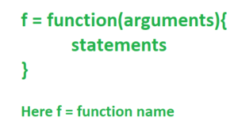
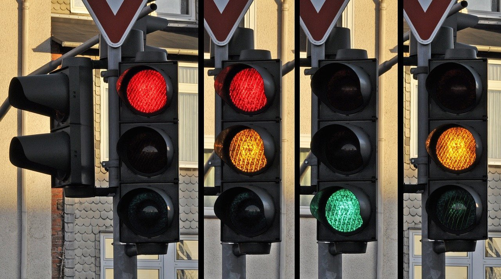

# Super quick intro to coding and data in R {#dataintro}

{width=75%}

## Coding/programming in R

Now that you’re set up with R and RStudio, you are probably asking yourself, “OK. Now how do I use R?”. The first thing to note is that unlike other statistical software programs like Excel, SPSS, or Minitab that provide point-and-click interfaces, R is an interpreted language. This means you have to type in commands written in R code. In other words, you have to code/program in R. Note that we’ll use the terms “coding” and “programming” interchangeably throughout this course.

While it is not required to be a seasoned coder/computer programmer to use R, there is still a set of basic programming concepts that new R users need to understand. Consequently, while this course is not focused on learning programming, you will still learn just enough of these basic programming concepts needed to explore and analyze data effectively.

## Basic terminology in R

We now introduce some basic programming concepts and terminology. Instead of asking you to memorize all these concepts and terminology right now, we’ll guide you so that you’ll “learn by doing.” To help you learn, we will always use a different font to distinguish regular text from computer_code. Also we will go through a tiny bit of information and then ask you do a similar task on your computer.




On this plot you can see the overview of Rstudio. This contains the following elements:

Console pane: where you enter in commands. 

R script: Where you store your commands often in a text file. 

R environment: What objects are registered/loaded in the environment (we will get back to that). 

Graphical output: Where you can see figures that is produced by commands in the console. 


This figure shows some of the more important data types in R and how they relate to storing data in R. 
It seems simple when set up like this, but when you are coding and you need to find an error this figure is
a good place to start.

Vectors can be created by using the ``` c()``` function in R. The c stands for concatenate.
for example the following command creates a vector of integers 1,2,3,4: 
``` my_vector <- c(1,2,3,4)```

Matrices can be created by using the ``` matrix()``` function in R. Matrices are great for doing calculations
incredibly fast BUT they can only contain one type of data unlike dataframes. For example the following command creates a matrix with the same four integers 1,2,3,4: 
``` my_matrix <- matrix(c(1,2,3,4))``` you can also rearrange the matrix so that it has two columns instead of one:
``` my_matrix <- matrix(c(1,2,3,4),ncol=2)```
you can look at your matrix by typing ``` my_matrix``` in the console.

Data frames is a way to store data containing both strings, integers, factors together. They are rectangular spreadsheets. Typically you have a dataset where the rows correspond tot eh observations/samples and the columns correspond to the variables that describe the observations. And this is the typical format when we analyse data. We can create a data frame in R with mixed data like this:
``` my_df <- data.frame(int = c(1,2,3,4),names = c("Villy","Søren","Karl","Benny"))```.




*Conditionals:*

Often we subset our data using conditions, e.g. we only want samples of our data frame that has a value in column 3 that is larger than X. Do this kind of subsetting, we use *conditionals*.

For example, using the data frame from before, we can restrict rows to those that have a integer value larger than
2 like this:
``` my_df[my_df$int > 2,]``` This will capture the last two rows of the data. Notice the comma, which is essential
when indexing dataframes: everything before the comma is subsetting on rows while after the comma is for subsetting columns. We can also subset using equality using == (and NOT =, which is used for assignment). Here is an example using equality: ``` my_df[my_df$names == "Karl",]```.  
The final example of something similar to but not identical is a binary operator %in% which is not listed in the figure above but still very useful. This weirdly looking %in% is describing a operator (which we will get back to and use later) which can search for overlaps e.g. in R:
``` my_df[my_df$names %in% c("Karl","Villy"),]``` See here that we find the overlap between names in my_df and the provided vector and only showing the rows of the data frame where there is an overlap.





Functions, also called commands: Functions perform tasks in R. They take in inputs called arguments and return outputs. You can either manually specify a function’s arguments or use the function’s default values.
For example, the function ```seq()``` in R generates a sequence of numbers. If you just run ```seq()``` it will return the value 1. That doesn’t seem very useful! This is because the default arguments are set as ```seq(from = 1, to = 1)```. Thus, if you don’t pass in different values for from and to to change this behavior, R just assumes all you want is the number 1. You can change the argument values by updating the values after the = sign. If we try out ```seq(from = 2, to = 5)``` we get the result 2 3 4 5 that we might expect.


This list is by no means an exhaustive list of all the programming concepts and terminology needed to become a savvy R user; such a list would be so large it wouldn’t be very useful, especially for novices. Rather, we feel this is a minimally viable list of programming concepts and terminology you need to know before getting started. We feel that you can learn the rest as you go. Remember that your mastery of all of these concepts and terminology will build as you practice more and more.

### Your turn{#ex1}

Exercise 1.

1. Create a dataframe with the following information (you pick the dataframe name):
two column dataframe. One with the names:
```c("Villy","Søren","Karl","Benny","Siri")``` and One with the following grades:``` c(100,20,40,30,60) ```. 

2. Use the ``` mean() ``` function to calculate the mean for passing grades (>30). There are many ways to do this
but a hint is that we only need to run one command. you can always see more information about the function by writing
``` ?mean ``` in your console.

## Error messages

One thing that intimidates new R and RStudio users is how it reports errors, warnings, and messages. R reports errors, warnings, and messages in a glaring red font, which makes it seem like it is scolding you. However, seeing red text in the console is not always bad.

R will show red text in the console pane in three different situations:



If the text starts with “Error”, figure out what’s causing it. Think of errors as a red traffic light: something is wrong!
If the text starts with “Warning”, figure out if it’s something to worry about. For instance, if you get a warning about missing values in a scatterplot and you know there are missing values, you’re fine. If that’s surprising, look at your data and see what’s missing. Think of warnings as a yellow traffic light: everything is working fine, but watch out/pay attention.
Otherwise, the text is just a message. Read it, wave back at R, and thank it for talking to you. Think of messages as a green traffic light: everything is working fine and keep on going!

## Coding tips and tricks

Learning to code/program is quite similar to learning a foreign language. It can be daunting and frustrating at first. Such frustrations are common and it is normal to feel discouraged as you learn. However, just as with learning a foreign language, if you put in the effort and are not afraid to make mistakes, anybody can learn and improve.

Here are a few useful tips to keep in mind as you learn to program:


*Remember that computers are not actually that smart*: You may think your computer or smartphone is “smart,” but really people spent a lot of time and energy designing them to appear “smart.” In reality, you have to tell a computer everything it needs to do. Furthermore, the instructions you give your computer can’t have any mistakes in them, nor can they be ambiguous in any way.   


*Take the “copy, paste, and tweak” approach*: Especially when you learn your first programming language or you need to understand particularly complicated code, it is often much easier to take existing code that you know works and modify it to suit your ends. This is as opposed to trying to type out the code from scratch. We call this the “copy, paste, and tweak” approach. So early on, we suggest not trying to write code from memory, but rather take existing examples we have provided you, then copy, paste, and tweak them to suit your goals. After you start feeling more confident, you can slowly move away from this approach and write code from scratch. Think of the “copy, paste, and tweak” approach as training wheels for a child learning to ride a bike. After getting comfortable, they won’t need them anymore.   


*The best way to learn to code is by doing:* Rather than learning to code for its own sake, we find that learning to code goes much smoother when you have a goal in mind or when you are working on a particular project, like analyzing data that you are interested in and that is important to you.   
Practice is key!

## Install and load package {#installpackages}

So we alluded to that the environment contains many objects and some of these objects come from packages. Packages
in R is precalculated functions and useful tools to work with your data. Therefore, embrace packages and get familiar with some of them. Some of the more important ones we will use in this course are:
``` tidyverse ``` and ```dplyr``` for data massaging and wrangling and ```ggplot 2``` for visualizations.


So R is like a new mobile phone: while it has a certain amount of features when you use it for the first time, it doesn’t have everything. R packages are like the apps you can download onto your phone from Apple’s App Store or Android’s Google Play.

Like an app on your smartphone, you need to install it first and the open it.

if you try to load a package that is not installed you get an error for instance

``` library(tidyverse) ``` and if not you know that tidyverse is installed

To install the tidyverse package do the following:

``` install.packages("tidyverse") ```

and to load it subsequently, write ``` library(tidyverse) ```.

Now install ``` broom ``` , ``` tidyverse ```  and ``` dplyr ```
using this approach


## Exercise answers

The answer to [exercise 1](#ex1) can be seen here:
```{r eval=F,echo=T}
my_data <- data.frame(
  names = c("Villy", "Søren", "Karl", "Benny", "Siri"),
  Grades = c(100, 20, 40, 30, 60)) 
``` 

```{r eval=F,echo=T}
mean(my_data[my_data$Grades > 30,]$Grades,na.rm=T) 
```


